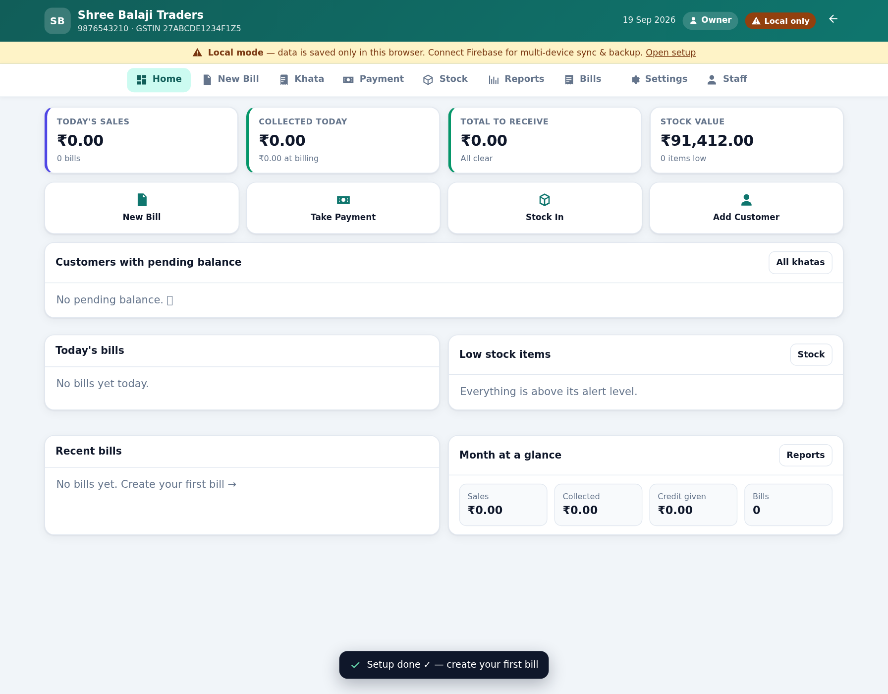
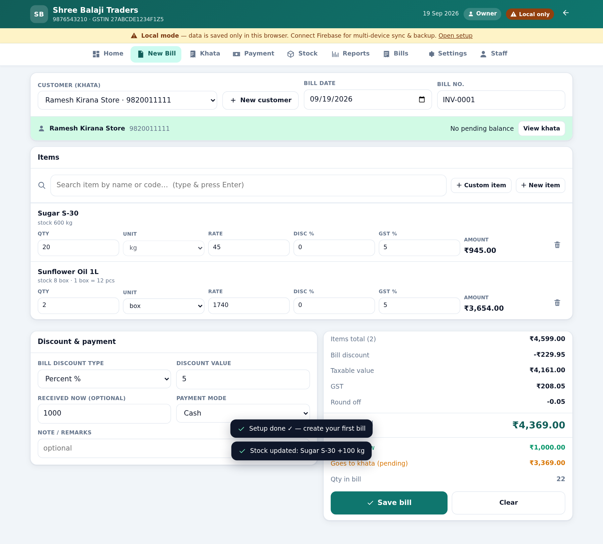
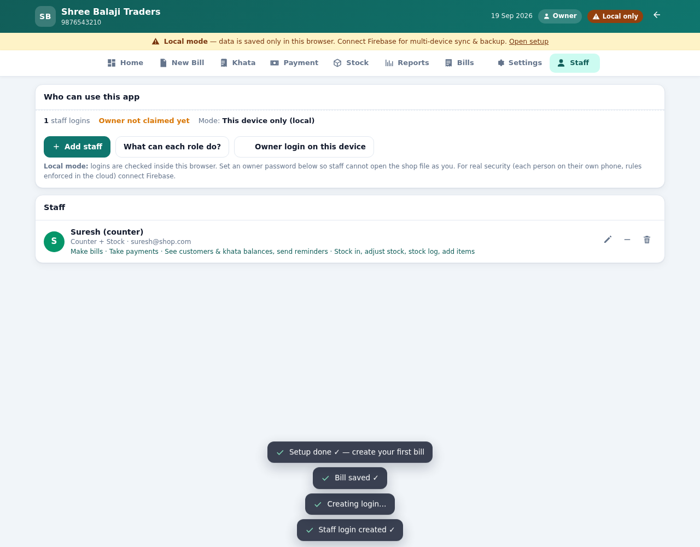

# Wholesale Store Billing — Billing + Khata (Udhaar) + Stock

A complete billing app for a wholesale shop, built for how the shop actually runs:

* bills are made fast (search item → Enter → qty)
* regular customers **take goods 5–7 times and pay later** — every bill goes to their **khata**
* **every night they pay some amount** — record the payment, it automatically clears their **oldest bill first**
* **stock updates itself** — selling reduces stock, editing/deleting a bill puts it back, every change is logged
* prints a **GST bill / receipt / khata statement / night day-close summary**, and sends bills on **WhatsApp**
  — the button opens the customer's chat with the bill already typed (WhatsApp Web on the PC, app on the phone)
* gives every customer a **login** to a portal where they see their **own balance, bills and payment history**
* **host on GitHub Pages, backend on Firebase** (or run it 100% offline in local mode)

It is one self-contained HTML file. No server, no build step needed to run, no monthly cost.

> **Live app:** <https://noamzaki.github.io/noamzaki/> — owner login from Firebase.
> Want to try it without touching the cloud? Open
> **<https://noamzaki.github.io/noamzaki/?local=1>** — that keeps everything in your browser
> (Local mode), so you can click around freely.





---

## 1. Quick start (local mode, 2 minutes)

1. Copy **`index.html`** to your computer or phone.
2. Double-click it (or open it in Chrome).
3. Fill the first-run screen: shop name, phone, GSTIN → **Start billing**.

Data is saved in that browser. Great for trying it out. For real use with backups and
multi-device sync, connect Firebase (section 3).

---

## 2. Host it on GitHub Pages (free, gets you a proper URL)

```bash
git init
git add .
git commit -m "Wholesale billing app"
git branch -M main
git remote add origin https://github.com/<your-username>/wholesale-billing.git
git push -u origin main
```

Then on GitHub: **Settings → Pages → Source: Deploy from a branch → Branch: `main` / `root` → Save**.

Your app is live at `https://<your-username>.github.io/wholesale-billing/` in about a minute.

* Put the app on the counter PC and each staff phone as a bookmark / home-screen icon
  (Chrome → ⋮ → **Add to Home screen**). It works like a normal app, and offline too.
* Personal data is never in the repo — it lives in your Firebase project (section 3) or in
  the browser's storage (local mode).

---

## 3. Connect Firebase (sync + backup + login)

**a) Create the project**
1. Go to <https://console.firebase.google.com> → **Add project** (name: `my-wholesale-store`). Google Analytics not needed.
2. **Build → Authentication → Get started → Sign-in method → Email/Password → Enable.**
3. **Authentication → Users → Add user** — e.g. `owner@yourshop.com` with a password. *This is your app login.*
4. **Build → Firestore Database → Create database → Production mode → Location: `asia-south1` (Mumbai).**

**b) Paste your keys**
5. Project settings (⚙️) → **Your apps → Web (`</>`)** → register an app → copy the `firebaseConfig`.
6. Open `index.html`, find the block right at the top marked **STEP 1 — PASTE YOUR FIREBASE CONFIG HERE**, and fill it in:

```html
<script>
window.FIREBASE_CONFIG = {
  apiKey: "AIza.....",             // ← your values
  authDomain: "my-wholesale-store.firebaseapp.com",
  projectId: "my-wholesale-store",
  storageBucket: "my-wholesale-store.appspot.com",
  messagingSenderId: "1234567890",
  appId: "1:1234567890:web:abcd1234"
};
</script>
```

7. Commit + push (or re-upload `index.html`). The app now shows a **login screen**, syncs live
   to Firestore, and shows a green **Synced** badge.

**c) Lock the database** (do not skip)
8. **Firestore → Rules** → paste the contents of [`firestore.rules`](firestore.rules) → **Publish**.
   Nothing to edit inside it: the first account that signs in claims ownership automatically, and
   staff get their permissions from the `staff/{uid}` documents the app creates for them.
   (Full click-by-click console walk-through: [`docs/FIREBASE-SETUP.md`](docs/FIREBASE-SETUP.md).)

**d) Authorise your domain**
9. **Authentication → Settings → Authorized domains → Add domain** → add
   `<your-username>.github.io` (only needed if login says the domain is not authorised).
10. Open the site, sign in with the owner account — that first sign-in claims ownership and the
   yellow "Local mode" banner turns into a green **Synced** badge. Then add staff from the
   **Staff** tab (it creates their Firebase logins for you).

> Free plan limits (50k reads / 20k writes per day) are far beyond a single shop's needs.
> Cost is ₹0 unless you grow to many branches.

---

## 4. How it works

### Billing (New Bill)
* Search any item by name/brand/code, press **Enter** to add it, then type qty/rate/discount/GST.
* Sell by **box or by piece** — set "pieces per box" on the item (e.g. 1 box = 12 pcs). Selling
  2 box of a 12-pc item deducts **24 pcs** from stock and prints "2 box × 12 pcs".
* Choose "Cash / Walk-in" for counter sales, or pick a customer to put the bill on their khata.
* **Received now** (optional): what the customer pays at the time of billing. The rest becomes khata.
* GST: per-item rate, bill-level discount, round-off, tax-inclusive (MRP) rates, and a rate-wise
  GST breakup on the print. Turn GST off entirely in Settings if you don't bill with tax.

### Khata (udhaar / credit ledger)
* Each customer has a running ledger: opening balance, every bill, every payment, live balance.
* Payments clear the **oldest unpaid bill first** (FIFO) — exactly how a shop notebook works.
  You can also link a payment to a specific bill.
* Extra payments become an **advance** (shown in green), never a negative bill.
* Per-customer: pending bills with age, print **khata statement**, **WhatsApp reminder** with the exact breakdown.
* Reports show how much is stuck: **0–15 / 16–30 / 31–60 / 60+ days**.

### Stock auto-management
* Every bill **auto-deducts** stock (boxes converted to pieces). Saving an edit reverses the old
  bill and applies the new one — stock never double-counts.
* Deleting/cancelling a bill **returns the stock** automatically.
* **Stock in** (purchase) increases stock and updates **weighted-average cost** for profit reports.
* **Adjust** records damage/expiry/self-use against a physical count.
* Every movement is kept in the **stock log** (date, item, qty, reason, reference, value) — exportable.
* Low-stock alerts per item; the **night day-close print** includes a reorder list.
* Broke something? Settings → **Recalculate** rebuilds stock from the movement history.

### Night routine (Day close)
Payments screen → **Print day-close summary**: bills made, total sales, cash/UPI at billing,
evening khata collections, **total collection for the day**, new udhaar given, mode-wise breakup,
list of payments, list of bills, write-offs and items to reorder. Perfect to staple with the cash box.

### Printing & WhatsApp

**Printing:** bill, receipt, khata statement, day-close and reports all print cleanly (A4 by default).
For a 58/80 mm thermal printer, choose the paper size in the print dialog.

**WhatsApp — one tap, chat already open with the bill typed in:**
Every bill has a **Send bill on WhatsApp** button (after saving, in the Bills list, on the bill's page,
and on each pending bill inside a khata). It opens the customer's WhatsApp chat with this text pre-filled:

```
*Shree Balaji Traders* · 9876543210
Bill: INV-0001   Date: 18 Sep 2026
Customer: Ramesh Kirana Store

1. Sugar S-30 — 20 kg × 45.00 = 900.00
2. Sunflower Oil 1L — 2 box × 1,740.00 = 3,480.00

Total: ₹4,369.00
Paid: ₹1,000.00
*Pending on this bill: ₹3,369.00*
*Total khata balance: ₹3,369.00*
```

You (or the customer) only press **Send** in WhatsApp — the app never sends anything by itself.

| Where | What it sends |
|---|---|
| Bill screen / after saving / Bills list / inside a khata | the bill (items, totals, pending balance) |
| Khata → any customer → **Payment reminder** | pending khata balance with each old bill and its age |
| Khata → any customer → **Send khata statement** | full ledger: every bill, payment and running balance |
| Payments → a receipt → WhatsApp icon | payment confirmation + remaining balance |

**PC vs phone (automatic):** the counter PC opens `web.whatsapp.com` — the tab you are
already logged into — and the phone opens the WhatsApp app. Both land **directly on that
customer's chat**, no "continue to chat" page in between, because the phone number is passed
with the message. Change it any time in **Settings → WhatsApp** ("Open WhatsApp using").

**Numbers:** saved as 10 digits, the country code from Settings is added automatically
(`98200 11111` → `919820011111`); numbers with a country code are left as they are.
If a customer has **no number saved**, the button asks for it once — saves it on the customer —
and then opens that chat. For a **cash/walk-in bill** there is no chat, so the message is copied
instead (paste it into any chat).

**Good to know**
* WhatsApp Web and the phone app are the same account — a message opened on the PC also appears
  in *your* app's "Message yourself"/recent list until you send it. You are never logged out anywhere.
* Opening the link does not mark the message as sent — nothing leaves your phone/PC until you press Send.
* A draft can only *start* a chat. To reply inside an existing conversation, open that chat in WhatsApp and paste (the message is copied if you tick
  **Settings → WhatsApp → Also copy the message to the clipboard**).

---

## 5. Customer portal (`<your-site>/#customer`)

Customers keep asking "*kitna baaki hai?*". Give each one a login and let them check themselves.

**Create a login (30 seconds):** Khata → tap a customer → **Create login** → type/accept a login ID
and the suggested password → **Create login** → **Send login details** (opens WhatsApp with the ID,
password and link already written for them).

What the customer sees after logging in — **only their own account, read-only**:
* big pending balance, plus total billed / total paid / last payment / oldest pending bill with its age
* *Bills to be settled* — each pending bill with what is left on it
* *All my bills* — tap any bill for item-wise detail (and the same printed invoice as yours)
* *Payments I have made* — date, amount, mode, which bill they cleared, UPI/cheque reference
* *My khata history* — the full running-balance ledger
* **Print / save as PDF statement**, **Send my statement on WhatsApp** (to themselves), and
  **Message the shop** (opens a chat to you with their balance already written)
* Sign out

**Security — this is the part that matters**
* With Firebase connected, each customer login is a **real Firebase Auth account** (created in a
  *separate* Firebase app instance, so a customer signing in never signs you out, and vice versa).
* `firestore.rules` lets a signed-in customer read **only** their own customer record, their own
  invoices and their own payments — nothing else. All their queries are filtered, so the rules can
  enforce it (`where('customerId','==',…)`), and every write is denied.
* Passwords are hashed by Firebase and are never stored in your data. The app-generated password is
  only shown to you once — send it immediately (the send dialog pre-fills it).
* The shop name/phone/address shown on the login page comes from a small public `portal_shop` document
  (nothing sensitive — the same details printed on every bill).
* **Settings → Customer portal**: copy the link, open it yourself, and a switch to **close the portal**
  instantly (logins stop working) without deleting anything.
* In Local mode the login is only checked inside that browser — the card says so plainly.
  **Connect Firebase before handing out logins to customers.**

**Publish the rules before the first customer login** (Firebase → Firestore → Rules → the
`firestore.rules` file in this repo → Publish), otherwise the portal will say the rules are not ready.

---

## 6. Staff logins & permissions (aapke staff ke liye)

Give each worker their **own login** with only the rights they need. The owner keeps settings,
staff and data — always.

**Add a staff login:** **Staff** (in the side menu) → **Add staff** → name, email, password,
pick a role preset. On Firebase the login is a real Firebase Auth account; the permission list is
stored in `staff/{uid}` in Firestore, so the same person can sign in from any device.

| Role | Billing | Payments | Khata | Stock | Reports | Cost/Profit | Edit+Delete bills | Settings | Staff/Data |
|---|---|---|---|---|---|---|---|---|---|
| **Owner** | ✔ | ✔ | ✔ | ✔ | ✔ | ✔ | ✔ | ✔ | ✔ |
| **Manager** | ✔ | ✔ | ✔ | ✔ | ✔ | ✔ | ✔ | ✔ | — |
| **Counter** (billing + stock) | ✔ | ✔ | ✔ | ✔ | — | — | — | — | — |
| **Cashier** (billing + payments) | ✔ | ✔ | ✔ | — | — | — | — | — | — |
| **Store keeper** | — | — | ✔ | ✔ | — | — | — | — | — |
| **Custom** | tick the 12 permissions one by one |

The 12 permissions: `bill`, `payment`, `khata`, `stock`, `reports`, `cost`, `deleteBill`,
`deletePayment`, `settings`, `data`, `staff`, `portal`. On Custom you can tick/untick each box.

**What the app enforces (not just hides)**
* Screens the login may not open aren't even in the menu — forcing the tab shows a **No access**
  card instead of the data.
* Every write action re-checks the permission (`requirePerm`), so a blocked tap gets
  *"Only the owner has permission to …"* — even if the button were triggered directly.
* **Money hiding**: sales/collected/receivable/profit figures, purchase cost, stock value and
  margin are only shown to logins with `reports` / `cost`. A cashier still sees prices and stock
  while billing.
* Every bill stores **who billed it**; the name shows on the bill row, in the invoice and on the
  printed bill.
* With Firebase, the same rules are enforced **server-side** in `firestore.rules`
  (`isOwner()` from `settings.ownerUids`, `can(perm)` from the `staff/{uid}` document,
  `active == false` ⇒ login refused).

**Turning someone off:** Staff → the ON/OFF switch (Firebase: the rules stop them instantly).
**Remove** deletes the permission record; delete the Auth user in Firebase too if you also want to
kill the email account. **Owner login on this device** (Local mode only) sets the password this
browser asks for before opening the shop as owner.

> **Local mode caution:** with no Firebase keys, logins are checked inside that browser only.
> That is fine for a single PC, but it is *not* real security — connect Firebase before you give
> logins to people you don't fully trust.

---

## 7. Backups

* **Settings → Download full backup (JSON)** — everything (items, customers, bills, payments, stock log).
  Do it weekly and keep the file on your phone/Google Drive.
* **Restore from backup** merges a backup file back in (same IDs are overwritten).
* CSV exports for Excel/Tally-style work: bills, khata, stock, movements, payments, report.
* With Firebase, your data is also in the cloud and the app keeps an offline copy on each device
  (so a dead laptop or lost phone never loses a bill).

---

## 8. Project structure

```
index.html              ← the built app (single file: HTML + CSS + JS). Host this.
firestore.rules         ← paste into Firebase → Firestore → Rules
sw.js                   ← service worker: lets the app open offline (optional, served next to index.html)
build.py                ← rebuilds index.html from src/
src/index.html          ← HTML shell (contains the FIREBASE_CONFIG block)
src/styles.css          ← styles, incl. the print layout
src/js/00-core.js       ← pure logic: money rounding, GST, khata/FIFO, stock, reports (unit-tested)
src/js/10-db.js         ← Firebase + local storage data layer, all writes
src/js/20-ui.js         ← app shell, icons, toasts, modals, event delegation
src/js/25-shell.js      ← header, navigation, shared components
src/js/30-dash-bill.js  ← dashboard + billing screen
src/js/35-invoices.js   ← bills list, invoice view, printing, WhatsApp, CSV
src/js/40-khata.js      ← khata list/detail, payments, reminders, statements, day close
src/js/45-stock.js      ← stock list, stock-in, adjustments, movement log
src/js/50-reports-settings.js ← reports, settings, backup/restore, demo data, portal admin
src/js/55-portal.js     ← customer portal: login, balance, bills, payments, statement
src/js/57-staff.js      ← staff logins, role presets, the permission engine (can/requirePerm)
src/js/60-boot.js       ← startup, login, onboarding, demo seed
tests/logic.test.mjs    ← 47 unit tests for money/khata/stock maths
tests/e2e.mjs           ← 40 end-to-end tests in real Chrome (billing, stock, khata, edit, delete)
tests/smoke.mjs         ← 33 checks that every screen renders (full shop + empty shop)
tests/whatsapp.mjs      ← 28 checks on the WhatsApp links (desktop/phone, drafts, reminders)
tests/portal.mjs        ← 52 checks on the customer portal incl. privacy + rules safety
tests/staff.mjs         ← 64 checks: roles, hidden money, refused actions, rules parity
tests/live.mjs          ← 15 checks against the DEPLOYED site (boot, Firebase, portal, no 404s)
tools/setup-chrome.sh   ← one-shot Chrome + shared libraries for the test suites (Linux)
docs/OWNER-GUIDE.md     ← one-page guide for the shop owner (Hinglish)
docs/FIREBASE-SETUP.md  ← console walk-through: rules to paste, auth, domain, checklist
```

### Developing

```bash
python3 build.py           # concat src/js/* → src/js/app.bundle.js → inline everything into index.html
node tests/logic.test.mjs  # pure-logic unit tests (no browser needed)
python3 -m http.server 8099 &
node tests/e2e.mjs         # needs Chrome (puppeteer); walks the real UI
node tests/smoke.mjs
node tests/whatsapp.mjs
node tests/portal.mjs
node tests/staff.mjs       # roles + permissions (one browser context per role)
node tests/live.mjs        # checks the deployed site (no data touched)
```

The browser suites add `?local=1` to the URL, so they always run in Local mode and never read or
write your real Firebase project. `npm run test:live` checks the deployed site instead
(needs internet; it only tries one deliberately-wrong login).

On a fresh Linux box `npm install` + `bash tools/setup-chrome.sh` prepares Chrome for the browser
tests (they need `LD_LIBRARY_PATH=$PWD/.cache/chromelibs`).

Edit files in `src/`, run `python3 build.py`, commit. `index.html` at the root is the deliverable.

---

## 9. Troubleshooting

| Symptom | Fix |
|---|---|
| Yellow "Local mode" banner | `FIREBASE_CONFIG` in `index.html` is empty, or the page couldn't load the Firebase SDK (needs internet once). Note `?local=1` in the URL forces Local mode on purpose. |
| Login says "domain not authorised" | Firebase → Authentication → Settings → Authorized domains → add your `github.io` domain. |
| Login says "Email/Password sign-in is not enabled" | Enable it in Authentication → Sign-in method. |
| Everyone can read my data | You left Firestore in test mode. Publish `firestore.rules` with your emails. |
| Stock looks wrong | Settings/Stock → **Recalculate** rebuilds stock from the movement log. |
| Big bill on one page? | Print dialog → choose paper size (A4 / 80 mm) and scale. |
| Two devices edited the same bill | Firestore keeps both edits and syncs; last write wins, and the stock log shows the full trail. |
| Customer forgot their password | Khata → customer → **Change password** (owner sets it; no email needed). |
| "Rules are not ready" in the portal | Publish `firestore.rules` in Firebase → Firestore → Rules. |
| "This login is already taken" | The account exists in Firebase → Authentication but not in the app (e.g. after a restore). Use another ID, or delete the user in Firebase and create again. |
| Staff member sees "No access" on a screen | Their role/permissions don't include it — Staff → edit → tick the box (Custom role). |
| Staff login says "not enabled in the shop app" | Their `staff/{uid}` document is missing or `active` is off: Staff → add again / switch ON. |
| Staff can see the profit or stock value | Turn off the `cost` (and `reports`) permission for that role. |
| Staff forgot their password (Firebase) | Staff → their name → **Send password reset** — a link is emailed (Firebase holds passwords; the owner cannot type one in). |
| Need to change a staff login email | Remove the person and add them again with the new email (Firebase logins are keyed by email). |
| Want to stop a customer's access | Khata → customer → **Remove login** (enter the password to also delete it in Firebase), or close the whole portal in Settings. |

---

Built to be owned by the shop: one file, your data, your Firebase project. No subscriptions.
